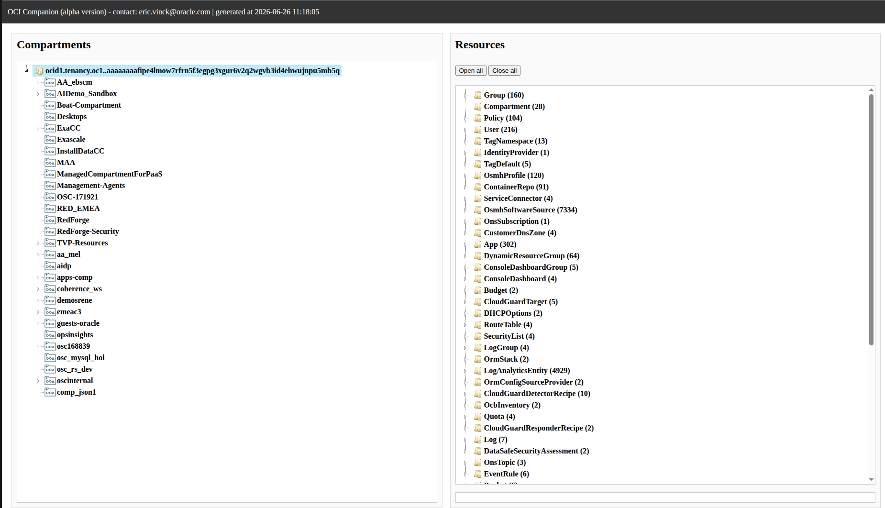

## About

This tool is meant to be a helper for exploring resources in your OCI tenant.
Using the search API of OCI, it scans all the resources in all subscribed regions and then renders the results as a tree structure in your web browser like below :



## Get the docker image 

Download this github repository and build the docker image : 


````
git clone https://github.com/evinck/oci-companion
cd oci-companion
docker build -t oci-companion .
````
Alternatively you may use the already built image : 

````
docker pull docker.io/ericvinck/oci-companion:alpha
````

## Requirements 

You need your ``.oci/config`` file to be ready for accessing your tenant (as explained here : https://docs.oracle.com/en-us/iaas/Content/API/Concepts/sdkconfig.htm).

Currently the tool requires the ``key_file`` file refered in the ``config`` file to be located in the same ``.oci`` directory, as we're mounting whole directory when running the docker image. 

You can also create a local `.env` file from [.env.example](.env.example) for HTTPS and OCI IAM settings. OCI Companion is intended to run only from the container image; the container entrypoint loads `/app/.env` automatically when it exists.

## How to run

````
docker run -it \
  -v $HOME/.oci:/root/.oci:Z \
  -v $PWD/certs:/app/certs:Z \
  -v $PWD/.env:/app/.env:Z \
  -p 8080:8080 \
  -e OCI_COMPANION_SSL_CERT_FILE=/app/certs/localhost-cert.pem \
  -e OCI_COMPANION_SSL_KEY_FILE=/app/certs/localhost-key.pem \
  oci-companion
````

By default, the tool will explore everything in your OCI tenant starting from the root compartment. 
If you want to limit the search to a single compartment, you can use the ``--compartment_id`` option like below : 

````
docker run -it \
  -v $HOME/.oci:/root/.oci:Z \
  -v $PWD/certs:/app/certs:Z \
  -v $PWD/.env:/app/.env:Z \
  -p 8080:8080 \
  -e OCI_COMPANION_SSL_CERT_FILE=/app/certs/localhost-cert.pem \
  -e OCI_COMPANION_SSL_KEY_FILE=/app/certs/localhost-key.pem \
  oci-companion --compartment_id <compartment id>
````

The tool will display something like this while exploring : 
````
Querying OCI and making up internal database (can be long !) .....................
Writing the data.json file to DocumentRoot/data.json
Serving HTTPS on 0.0.0.0 port 8080 (https://0.0.0.0:8080/) ...
````

Once you see the you can open a web browser at localhost : 

``xdg-open https://localhost:8080``

When the container starts, it generates `DocumentRoot/data.json` once at startup and then refreshes it continuously in the background. As soon as one OCI scan finishes, the next one starts.

## UI debug mode

If you already have a local `DocumentRoot/data.json` file and only want to test the web UI, run without querying OCI through the container image:

````
./run-local.sh --ui-debug
````

The local Podman helper builds the image, bind-mounts the local `DocumentRoot/data.json` into the container, and starts the app with `--ui-debug`. In UI debug mode the app serves the existing data file and does not generate or refresh it.

## OCI IAM authentication

The application can now protect the UI and `data.json` with OCI IAM Identity Domains using the OpenID Connect authorization code flow.

Authentication is optional. If the OCI IAM environment variables below are not provided, the application keeps running in local no-auth mode.

Required environment variables:

````
OCI_IAM_DOMAIN_URL
OCI_IAM_CLIENT_ID
OCI_IAM_CLIENT_SECRET
OCI_IAM_REDIRECT_URI
````

Optional environment variables:

````
OCI_IAM_SCOPES="openid profile email"
OCI_COMPANION_COOKIE_SECURE=true
OCI_COMPANION_SESSION_TTL_SECONDS=43200
OCI_COMPANION_HTTP_TIMEOUT_SECONDS=10
OCI_COMPANION_SSL_CERT_FILE=/app/certs/localhost-cert.pem
OCI_COMPANION_SSL_KEY_FILE=/app/certs/localhost-key.pem
````

Example:

````
docker run -it \
  -v $HOME/.oci:/root/.oci:Z \
  -v $PWD/certs:/app/certs:Z \
  -v $PWD/.env:/app/.env:Z \
  -p 8080:8080 \
  -e OCI_COMPANION_SSL_CERT_FILE=/app/certs/localhost-cert.pem \
  -e OCI_COMPANION_SSL_KEY_FILE=/app/certs/localhost-key.pem \
  -e OCI_IAM_DOMAIN_URL=https://<your-identity-domain> \
  -e OCI_IAM_CLIENT_ID=<client-id> \
  -e OCI_IAM_CLIENT_SECRET=<client-secret> \
  -e OCI_IAM_REDIRECT_URI=https://localhost:8080/auth/callback \
  oci-companion
````

The configured redirect URI must exactly match the callback route exposed by the app.

For local/container testing without OCI IAM authentication, start the image with `--noauth`:

````
./run-local.sh --noauth
````

This bypasses the OCI IAM login flow even if IAM values are present in `.env`.

If you already have a `DocumentRoot/data.json` file and do not want to query OCI again at startup, run the web app with `--keep-existing-data`.

## Local self-signed HTTPS

The web app only starts over HTTPS and requires a certificate and private key.

Generate a self-signed certificate for `localhost`:

````
mkdir -p certs
openssl req -x509 -newkey rsa:2048 -nodes \
  -keyout certs/localhost-key.pem \
  -out certs/localhost-cert.pem \
  -days 365 \
  -subj "/CN=localhost"
````

Then start the container with:

````
docker run -it \
  -v $HOME/.oci:/root/.oci:Z \
  -v $PWD/certs:/app/certs:Z \
  -v $PWD/.env:/app/.env:Z \
  -p 8080:8080 \
  -e OCI_COMPANION_SSL_CERT_FILE=/app/certs/localhost-cert.pem \
  -e OCI_COMPANION_SSL_KEY_FILE=/app/certs/localhost-key.pem \
  oci-companion
````

If you also use OCI IAM authentication locally, use an `https://localhost:8080/auth/callback` redirect URI and set `OCI_COMPANION_COOKIE_SECURE=true`.

## Using .env

Create a local env file from the example:

````
cp .env.example .env
````

Then fill in the OCI IAM values you need. The container entrypoint loads `/app/.env` automatically, so you can mount that file into the container and avoid repeating long `-e` lists.
