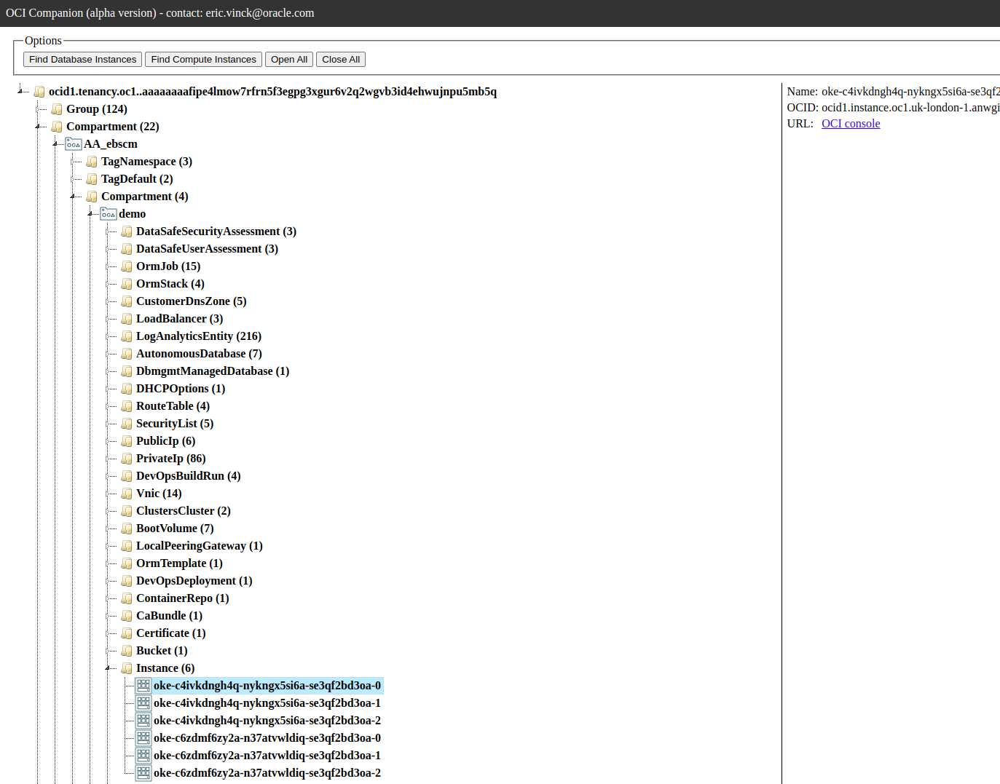

## About

This tool is meant to be a helper for exploring resources in your OCI tenant.
Using the search API of OCI, it scans all the resources in all subscribed regions and then renders the results as a tree structure in your web browser like below :



## Get the docker image 

Download this github repository and build the docker image : 


````
git clone https://github.com/evinck/oci-companion
cd oci-companion
docker build -t oci-companion .
````
Alternatively you may use the already built image : 

````
docker pull docker.io/ericvinck/oci-companion:alpha
````

## Requirements 

You need your ``.oci/config`` file to be ready for accessing your tenant (as explained here : https://docs.oracle.com/en-us/iaas/Content/API/Concepts/sdkconfig.htm).

Currently the tool requires the ``key_file`` file refered in the ``config`` file to be located in the same ``.oci`` directory, as we're mounting whole directory when running the docker image. 

## How to run

````
docker run -it -v $HOME/.oci:/root/.oci:Z -p 8080:8080 oci-companion
````

By default, the tool will explore everything in your OCI tenant starting from the root compartment. 
If you want to limit the search to a single compartment, you can use the ``--compartment_id`` option like below : 

````
docker run -it -v $HOME/.oci:/root/.oci:Z -p 8080:8080 oci-companion --compartment_id <compartment id>
````

The tool will display something like this while exploring : 
````
Querying OCI and making up internal database (can be long !) .....................
Writing the data.json file to DocumentRoot/data.json
Serving HTTP on 0.0.0.0 port 8080 (http://0.0.0.0:8080/) ...
````

Once you see the you can open a web browser at localhost : 

``xdg-open http://localhost:8080``

